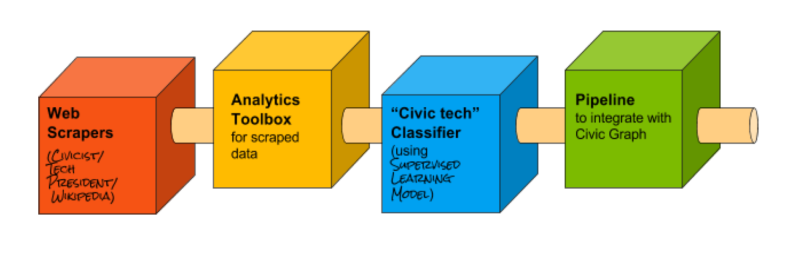

# Smarter Data Collection for Microsoft Civic Graph

In an effort to make [Civic Graph](http://civicgraph.io) a little bit smarter, I developed four building blocks to help improve the quality (i.e. accuracy, completeness) of the data stored as well as automate aspects of the data collection process. They are:

* [__Web Scrapers__](/Scrapers)
* [__Analytics Toolbox__](/Analysis)
* [__Classifier__](/Classifier)
* [__Pipeline__](/References/Pipeline Diagram.pdf) to integrate *scrapers*, *classifier*, and *analysis* with existing Civic Graph

# Useful Resources within this Repository:

* I created a __Process Map__ to explain how everything that I built fits together. View it [here](/References/Mad Libs Visual .pdf)

* I also created a __Handoff Document for a Future Fellow__ outlining how each script works, external libraries used, and how they can fully integrate my work with the existing Civic Graph in the future. View the document [here](/References/Handoff for Future Fellow.pdf).
 
  

---

 

# External Resources:

I've compiled a list of tools and resources that I used throughout the project. They cover a range of topics including:

* Web Scraping
* Data Analysis with Python
* Text mining
* Natural Language Processing
* Machine Learning

### __Libraries, tools, APIs:__

* [BeautifulSoup](https://www.crummy.com/software/BeautifulSoup/bs4/doc/): Python library for parsing XML and HTML.

* [spaCy](https://spacy.io/): Free, open-source Python library for fast and accurate Natural Language Processing analysis.

* [textacy](https://github.com/chartbeat-labs/textacy): Python library built on top of spaCy for higher level Natural Language Processing (NLP).

* [nltk](http://www.nltk.org/): Platform for writing python programs to work with human language data.  Provides over 50 corpora and lexical resources. Includes text processing libraries for classification, tokenization, stemming, tagging, parsing, semantic reasoning, wrappers for industrial-strength NLP libraries.  Tools are easy to use and accurate but very slow on large datasets.

* [scikit-learn](http://scikit-learn.org/stable/): Machine learning library in Python built on NumPy, SciPy, and matplotlib.

### __Concepts:__

* [Supervised Learning](https://en.wikipedia.org/wiki/Supervised_learning)

* [Support Vector Machine](https://en.wikipedia.org/wiki/Support_vector_machine)

* [Named-entity Recognition (NER)](https://en.wikipedia.org/wiki/Named-entity_recognition)

* [Term Frequency-Inverse Document Frequency (tf-idf)](https://en.wikipedia.org/wiki/Tf%E2%80%93idf)

* [Feature Extraction](https://en.wikipedia.org/wiki/Feature_extraction) 

### __Books:__

* [Python for Data Analysis](https://www.amazon.com/Python-Data-Analysis-Wrangling-IPython/dp/1449319793/ref=pd_sim_14_3?ie=UTF8&dpID=515XdK-YtFL&dpSrc=sims&preST=_AC_UL160_SR122%2C160_&psc=1&refRID=1XKK35B7MX9J9MDRK66H)

* [Natural Language Processing with Python](https://www.amazon.com/Natural-Language-Processing-Python-Bird/dp/0596516495)

* [Web Scraping with Python](https://www.amazon.com/Web-Scraping-Python-Collecting-Modern/dp/1491910291/ref=sr_1_fkmr0_4?s=books&ie=UTF8&qid=1470405642&sr=1-4-fkmr0&keywords=data+alanysis+in+python)

----

Created by Hannah Cutler during my fellowship at

